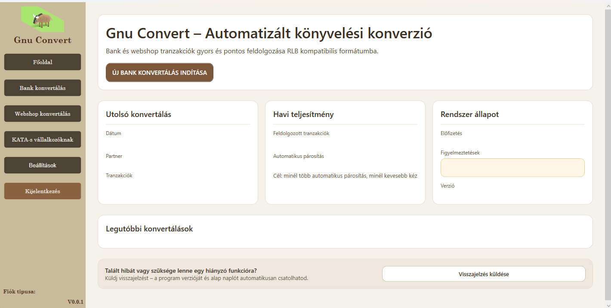

> Copyright © 2026 Taskovics Máté. All rights reserved.

# GnuConvert

GnuConvert is a Windows desktop application for preparing bank and myPOS
transactions for import into the RLB accounting system. It helps accounting
workflows by matching transactions to invoice records, applying partner-specific
ledger-account rules, and separating items that need manual review.

The application is written in C# with WPF and targets **.NET 9 for Windows**.



## What it does today

- Imports bank-statement CSV files for **OTP** and **UniCredit**.
- Imports **myPOS** transaction exports through a separate webshop/myPOS flow.
- Reads a semicolon-separated invoice-register export.
- Matches bank transactions to invoice records in this order:

  1. invoice number found in the transaction reference;
  2. indirect comparison using amount, partner name, and date;
  3. partner-specific, score-weighted keyword rules for a ledger-account suggestion.

- Creates RLB-style, semicolon-separated output files for successful and
  exceptional transactions.
- Lets the user create partners, review unmatched historical transactions, and
  save ledger-account rules per partner.
- Persists settings, partner metadata, and partner rules in local JSON files.
- Reports validation, file, and persistence errors in the UI.

## Workflow

```text
Choose or create a partner
        ↓
Choose the bank or myPOS pipeline
        ↓
Select the transaction export and invoice register
        ↓
Enter the bank ledger account
        ↓
Match transaction → invoice or partner rule
        ↓
Write RLB-compatible CSV output
        ├─ KonvertaltSzamlak.csv       (matched items)
        └─ KivetelesSzamlak.csv        (items requiring review)
```

### Partner rules

When creating a partner, GnuConvert analyses the selected transaction and
invoice files. Transactions that cannot be matched to an invoice are shown for
manual ledger-account assignment. The resulting rules are stored with the
partner and later used as the third matching step.

The current implementation is rule-based: it normalizes the transaction text,
searches matching keywords, and aggregates the stored scores by ledger account.
It is not a machine-learning model.

## Supported input pipelines

| Pipeline | Current support | Notes |
| --- | --- | --- |
| OTP | Yes | Semicolon-delimited CSV; the column map is defined in `BankDefinitions.cs`. |
| UniCredit | Yes | Semicolon-delimited CSV; ISO-8859-2 encoding is expected. |
| myPOS | Yes | Available from the webshop conversion page. |
| K&H, Revolut, Erste, GLS | No | Enum values or UI placeholders may exist, but no active bank definition is implemented. |

The bank and invoice parsers expect the known export layouts. Test source files
after a bank changes its export format, and do not assume arbitrary CSV layouts
will work.

## Getting started

### Requirements

- Windows 10 or later
- [.NET 9 SDK](https://dotnet.microsoft.com/download/dotnet/9.0)
- Optional: Visual Studio 2022 with the **.NET desktop development** workload

### Build and test

```powershell
git clone <repository-url>
cd GnuConvert

dotnet restore GnuConvert.sln
dotnet build GnuConvert.sln --configuration Release --no-restore
dotnet test GnuConvert.sln --configuration Release --no-build
```

### Run

```powershell
dotnet run --project src/GnuConvert/GnuConvert.csproj
```

Before the first conversion, open **Beállítások → Könyvelőknek** and configure
existing folders for the regular and exceptional output files. The default
location is `C:\Eredmeny`.

## Local data

Application data is stored outside the repository:

- `%AppData%\GnuConvert\settings.json` — output-folder and application settings
- `%AppData%\GnuConvert\partners\partners.json` — partner registry
- `%AppData%\GnuConvert\partners\<partner-id>\rules.json` — rules learned for a
  specific partner

Partner-rule writes use a temporary file and validation before the saved rules
replace the previous file.

## Project structure

```text
GnuConvert.sln
├── src/GnuConvert/
│   ├── BankImport/        bank definitions and CSV import
│   ├── Models/            invoices, transactions, partners, rules, output rows
│   ├── Services/
│   │   ├── Conversion/    matching and RLB-row generation
│   │   ├── GlAssignmentService/  partner-rule creation and account lookup
│   │   ├── IO/            import/export file handling
│   │   └── Storage/       JSON-backed settings and partner persistence
│   ├── ViewModels/        WPF presentation logic
│   └── Views/             WPF screens and controls
└── GnuConvert.Tests/      xUnit tests
```

## Architecture

The UI follows an MVVM-style separation:

- **Views** contain the WPF layout and interaction bindings.
- **ViewModels** expose commands and state to the UI.
- **Services** handle importing, matching, persistence, conversion, and output.
- **Models** describe invoices, transactions, partners, rules, and converted rows.

The application has no server component: conversion and JSON persistence run
locally on the user's computer.

## Current status and limitations

GnuConvert is an active development project, not a production-ready hosted
service. In particular:

- Login is a local, development-stage mechanism; it is not secure authentication
  and must not be used to protect real user accounts or production data.
- There is no ASP.NET Core backend, database, subscription validation, Stripe
  payment flow, or role-based authorization in the current implementation.
- The dashboard, KATA, NAV Online, general settings, and subscription areas are
  partly UI scaffolding or planned functionality.
- Ledger-account suggestions are rule-based; ML.NET packages are present in the
  project file but no trained ML model is used by the conversion flow.
- Automated tests currently cover selected parser and JSON-persistence behavior;
  broader end-to-end conversion coverage is still needed.

## Continuous integration

GitHub Actions restores, builds, and tests the solution on `windows-latest`
with .NET 9 for pushes to `master`, `feature/*`, `hotfix/*`, and `chore/*`, and
for pull requests targeting `master`.

## Roadmap

The next logical areas are:

- improve matching accuracy and explain why a transaction could not be matched;
- add more verified bank-import definitions and parser tests;
- increase conversion and integration-test coverage;
- replace the temporary local login with secure user management before any
  production use;
- build reporting, history, NAV Online, licensing, and subscription features
  only after the corresponding backend and security work exists.

## License

This source is publicly available for portfolio, educational, and code-review
purposes. It is proprietary software; copying, modifying, redistributing, or
commercial use requires prior written permission from the copyright holder.
See [LICENSE](LICENSE) for the full terms.
